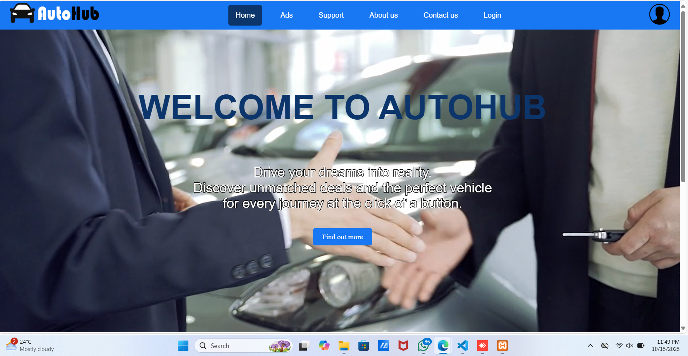

# 🚗 Autohub — Vehicle Service & Management (IWT Project)

An all-in-one PHP web app for booking vehicle services, managing records, leaving reviews, and handling payments.  
Built as our **first university project** for the **Internet & Web Technologies (IWT)** module at **SLIIT**.

---

## 📸 Preview
<!-- Replace with your image paths inside the repo (e.g., /Website/Images/home.png) -->

> Put screenshots in `docs/screenshots/` and update the paths above.

---

## 🎓 About the Project
This is our **first university project**. We learned:
- Building dynamic pages with **PHP, HTML, CSS, JS**
- Using **MySQL** and connecting it with PHP (mysqli)
- Running locally via **XAMPP** (Apache + MySQL)
- Version control with **Git & GitHub**

---

## 🌟 Features
- 👤 User auth: signup, login, change password
- 🧾 Service browsing & booking
- 💳 Payment flow (mock/real, depending on config)
- ✍️ Reviews & ratings
- 🛠️ Admin/Support pages (as implemented)

---

## 🧠 Tech Stack
| Layer | Tools |
|------|------|
| Frontend | HTML5, CSS3, JavaScript, Bootstrap |
| Backend | PHP (Procedural) |
| Database | MySQL |
| Dev Tools | XAMPP, VS Code, Git/GitHub |

---

## 🗂️ Project Structure
